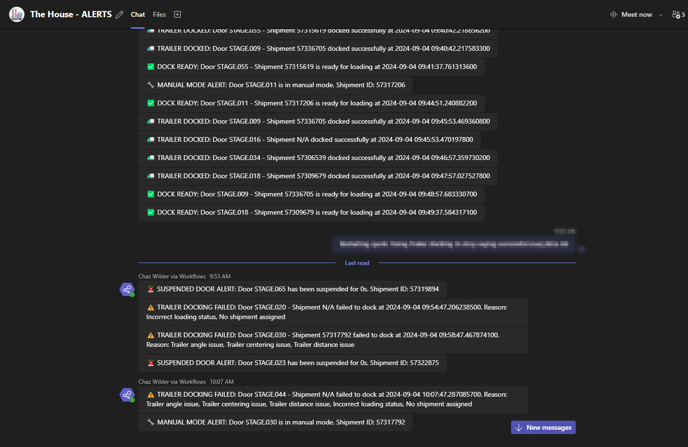
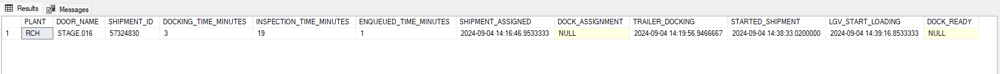
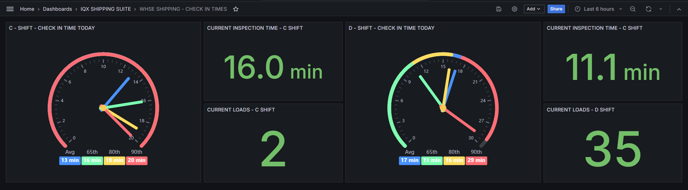

## IQX Dock Monitor

**Real-time Insights for Optimized Shipping Performance**

The IQX Dock Monitor empowers your shipping operations with real-time visibility and intelligent insights, driving efficiency and cost savings.

**Benefits:**

### For Management
- Minimize delays and reduce costs
- Enhance throughput and optimize resource allocation
- Enable data-driven strategic planning
- Future-proof operations with adaptable technology

### For Operators
- Reduce manual interventions with proactive alerts
- Improve efficiency in daily tasks
- Enhance visibility across all dock activities
- Better manage maintenance and repairs
- Make data-driven decisions
- Improve communication and collaboration
- Reduce stress and increase confidence in decision-making
- Facilitate training and onboarding of new team members
- Track and improve personal and team performance

**Features:**

* **Real-time Monitoring:** Track dock doors, LGVs, and shipments in real-time for complete visibility.
* **Intelligent Alerts:** Receive proactive notifications of potential issues and optimization opportunities.
* **Actionable Analytics:** Aggregate data from multiple sources for comprehensive performance analysis.
* **Robust Backend:** Rust-powered backend ensures reliability and performance for mission-critical operations.
* **Seamless Integration:** Connects with SQL Server, MongoDB, and RabbitMQ for a unified data ecosystem.

**Ideal for warehouse managers, operations teams, and IT professionals seeking to optimize shipping performance.**

## Technology Stack

- Backend: Rust
- Databases: SQL Server, MongoDB
- Message Broker: RabbitMQ

## Getting Started

### Prerequisites

* Rust toolchain (installation instructions can be found at [https://www.rust-lang.org/tools/install](https://www.rust-lang.org/tools/install))
* Docker (optional, for containerized deployment)
* Access to the required databases (SQL Server, MongoDB) and RabbitMQ

### Installation

1. Clone the repository:

   ```bash
   git clone https://github.com/chazwilder/iqx-dockmonitor.git
   ```

2. Navigate to the project directory:

   ```bash
   cd iqx-dockmonitor
   ```

3. Configure the application:

   * Update the configuration files (`default.yaml`, `rules.yaml`) with your specific settings.
   * Ensure the SQL queries in `queries.yaml` are compatible with your WMS database schema.

4. Build and run the application:

   ```bash
   cargo run --release
   ```

   For containerized deployment (optional):

   ```bash
   docker build -t iqx-dock-manager .
   docker run -d --name dock-manager -p 8080:8080 iqx-dock-manager
   ```

# Project Modularity

The IQX Dock Monitor's modular design allows for easy extension and customization. Here's a guide for developers on how to add new rules, alerts, and monitoring capabilities:

## Adding New Rules

1. **Define the Rule Logic:**
   - Create a new Rust file in the `src/rules` directory (e.g., `my_new_rule.rs`).
   - Implement the `AnalysisRule` trait, defining the `apply` method that encapsulates your rule's logic.
   - The `apply` method should take a `DockDoor` and a `DockDoorEvent` as input and return a `Vec<AnalysisResult>`.
   - Within the `apply` method, analyze the event in the context of the dock door's state and generate appropriate `AnalysisResult`s (e.g., `Alert`, `StateTransition`, `Log`, or `DbInsert`).

2. **Register the Rule:**
   - In `src/rules/rule_factory.rs`, add a new case to the `create_rule` method to handle your new rule type.
   - The case should call a constructor function in your rule file to create an instance of your rule.
   - The constructor function should take a `serde_json::Value` as input, allowing you to pass configuration parameters to your rule.

3. **Configure the Rule (Optional):**
   - If your rule requires configuration parameters, create a corresponding struct in your rule file to represent the configuration.
   - Deserialize the configuration from the `serde_json::Value` in your constructor function.

4. **Add the Rule to the Analyzer:**
   - In `src/main.rs`, load your new rule using the `DynamicRuleManager` and add it to the `ContextAnalyzer`.

## Adding New Alerts

1. **Define the Alert Type:**
   - In `src/analysis/context_analyzer.rs`, add a new variant to the `AlertType` enum to represent your new alert.
   - Include any necessary data fields that the alert needs to carry (e.g., door name, shipment ID, duration).

2. **Generate the Alert in a Rule:**
   - Within the `apply` method of your analysis rule, generate an `AnalysisResult::Alert` with your new `AlertType` when the rule's conditions are met.

3. **Handle the Alert in the `AlertManager`:**
   - In `src/alerting/alert_manager.rs`, add a new case to the `format_alert_message` method to handle the formatting of your new alert type into a human-readable message.
   - You might also need to update the `convert_alert_type` method if your alert requires special conversion logic.

## Adding New Monitoring Capabilities

1. **Define the Monitoring Item:**
   - In `src/monitoring/monitoring_queue.rs`, add a new variant to the `MonitoringItem` enum to represent the data you want to monitor.

2. **Add the Item to the Queue:**
   - Within the `EventHandler`'s `process_event` method (or another suitable location), add the new `MonitoringItem` to the `monitoring_queue` when appropriate.

3. **Process the Item in the `MonitoringWorker`:**
   - In `src/monitoring/monitoring_worker.rs`, add a new case to the `process_item` method to handle your new `MonitoringItem`.
   - Implement the logic to check the monitoring conditions, generate alerts if necessary, and decide whether to keep the item in the queue for further monitoring.

## Examples
### Alerts


## Consolidate Data Results


## Data Analytics


## Acknowledgments

* The Rust community for their fantastic language and ecosystem.
* The developers of the `config`, `sqlx-oldapi`, `tokio`, and other libraries used in this project.

**Disclaimer:** This project is a proof-of-concept demonstrating the power of real-time data and analytics in warehouse management. Specific configurations and integrations may need to be adapted to your environment.

**Let's revolutionize warehouse shipping together!**


